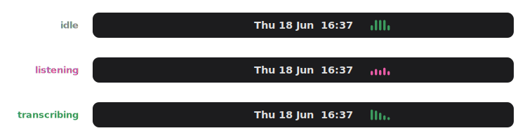
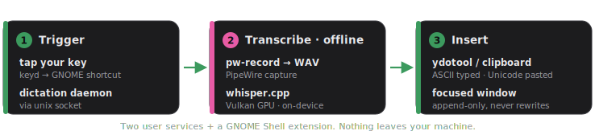

<br>

<p align="center">
  
</p>

<h1 align="center">
  dicti
</h1>

<p align="center">
  <b>Local, offline, live dictation for Linux.</b>
</p>

<p align="center">
  Tap key, talk, starts typing in your active window.
</p>

<br>

<p align="center">
  
</p>

<p align="left">
  <sub>dicti is fully on-device dictation. No cloud or account needed.</sub>
</p>

<br>

<p align="center">
  
  &nbsp;
  
  &nbsp;
  
  &nbsp;
  
</p>

<br>

## Hey and welcome 

dicti transcribes your speech on your **own machine** with
[whisper.cpp](https://github.com/ggerganov/whisper.cpp) and types it into the focused window
as you talk. No cloud, no account, nothing leaves your laptop.

I built it because I missed the great dictation I had on the Mac, and Linux deserved one too.
It's what I use every day. It's young and honest about its rough edges, and you're very welcome
to kick the tires, file issues, or help push it further.

> **Status:** v0.3.5 (alpha). Live streaming dictation that works well day to day. Tested on
> Debian + GNOME (X11). See the [roadmap](ROADMAP.md) for what's next.

## Calm by design

dicti stays out of your way. A single animated mark by your clock tells you everything at a
glance: green at rest, pink while it listens, a green sweep while it transcribes. No floating
windows, no notification on every word.

<p align="center">
  
</p>

<br>

## What it does

- **Click and Talk.** Live streaming: text shows up as you speak. Each pass
  re-transcribes the whole thing, so whisper always has full context (quality matches
  one-shot batch mode), and only words that have stabilised across passes get typed. It's
  append-only, so it never rewrites text behind your cursor. To switch to all-at-once:
  change `mode = "batch"`.
- **No halucinations on silence.** whisper-server runs with voice-activity detection
  (padded to not clip the first word), and the stabilise-across-passes rule is a second
  filter, so the classic silence hallucinations never reach the screen.
- **Speaks ~100 languages.** It's Whisper underneath, so whatever Whisper can transcribe, dicti
  types. It auto-detects the language each pass, or you can pin one in config.
- **Types anywhere.** ASCII goes in via `ydotool`; any non-ASCII (accents, Polish ąęóśżźćń, CJK,
  emoji) is pasted via the clipboard, so it works across editors, IDEs and terminals.
- **Not in your face** No popup spam, no tray clutter, no notification on every word. The
  top-bar glyph (above) is all you normally see.
- **Yours, offline.** whisper.cpp medium model, GPU-accelerated via Vulkan. Long sessions
  (1-hour cap) with a smart silence auto-stop.

## How it works

<p align="center">
  
</p>

Two small user services (`whisper-server`, `dictation`) plus a GNOME Shell extension
(`dicti@local`) for the indicator. The daemon mirrors its state to
`$XDG_RUNTIME_DIR/dictation.state` so the indicator can follow along.

<details>
<summary>The full path, step by step</summary>

```
[your key] -> keyd -> Super+Shift+Alt+F12 -> GNOME shortcut -> dictate-toggle
   -> unix socket -> dictation daemon -> pw-record -> /tmp WAV
   -> HTTP -> whisper-server (Vulkan) -> transcript -> ydotool / clipboard -> focused window
```

For *why* insertion works the type-ASCII / paste-Unicode way, see
[`specs/0001-text-insertion.md`](specs/0001-text-insertion.md).

</details>

## Quick start

You'll need:

- A Debian/Ubuntu-family distro (apt) with **PipeWire** audio
- A **Vulkan-capable GPU** (integrated is fine; CPU works but is ~4-5x slower)
- **GNOME Shell** (tested on 48) for the top-bar indicator
- **~1GB disk** for whisper.cpp and the quantized medium model (the ~1.5GB full
  model is downloaded once to quantize, then deleted). While running, the model
  stays hot in RAM (~0.5GB) for instant transcription.

```bash
git clone https://github.com/tksimson/dicti.git
cd dicti
bash install/install.sh
```

The guided installer runs the phases in order: system packages, the keyd key remap, building
whisper.cpp and fetching the model, the user services, ydotool, the GNOME shortcut, and the
indicator extension. You'll be asked to log out and back in once after the first phase so your
`input`-group membership takes effect. Each phase under `install/00..07` also runs on its own.

If your dictation key isn't a Copilot/AI key, run `sudo evtest` (or `wev` on Wayland) to find
its `KEY_*` name and edit `keyd/default.conf`.

## Using it

- **Tap** your bound key to start listening, **tap again** to transcribe and insert.
- Pause to think; it won't cut off until a few minutes of real silence.
- **Left-click** the indicator to toggle, **right-click** for a menu.
- From a shell: `dictate-toggle [START|STOP|TOGGLE|CANCEL|STATUS]`.
- Lost a good dictation? `dictate-last` reprints the last one (`--copy` to clipboard).

## Configuration

dicti runs fine with no config. To tweak, edit `~/.config/dicti/config.toml` (the installer
seeds one from [`config/config.toml.example`](config/config.toml.example)), then
`systemctl --user restart dictation`. Common knobs:

| Setting | What it does |
| --- | --- |
| `mode` | `streaming` (default) or `batch` |
| `language` | `auto`, or pin like `pl` / `en` for soft/ambiguous audio |
| `silence_timeout_sec` | how long of real silence before auto-stop |
| `insert_backend` / `paste_keys` | text insertion path and paste shortcut |
| `notify_level` | `error` (default), `off`, or `all` |

> **Tip:** Whisper transcribes one language per pass. `auto` works well for mixed use now that
> streaming keeps full context, but pin `language` to your main one if a quiet voice gets
> detected wrong.

## Compatibility

dicti is young, so this is honest about what's actually been tested. Help moving things up the
list is very welcome.

| Environment | Status | Notes |
| --- | --- | --- |
| **GNOME / Xorg** (Shell 48) | ✅ Tested, daily driver | The primary target. |
| wlroots Wayland (Sway/Hyprland) | 🚧 Should work, testers wanted | Native Unicode via `wtype`. |
| KDE / XFCE and other X11 | 🚧 Should work, testers wanted | Clipboard path + AppIndicator service. |
| GNOME / Wayland | 🚧 Unverified | Pieces are Wayland-safe; full path unproven. |
| Zed / VS Code integrated terminal | ⚠️ Known gap | Editor and terminal share one window, so the paste shortcut can't be auto-targeted. ASCII/English works; full Unicode works everywhere else (browsers, editors, native apps, standalone terminals). |

## Troubleshooting

<details>
<summary>Common fixes</summary>

- **Slow transcription / "Dictation degraded":** whisper-server fell back to CPU. Run
  `systemctl --user restart whisper-server`; check `journalctl --user -u whisper-server`.
- **Nothing types:** make sure `ydotoold` runs and `YDOTOOL_SOCKET` is set, and that you're in
  the `input` group (log out/in after install).
- **No top-bar icon:** reload GNOME Shell (Alt+F2, `r` on X11; log out/in on Wayland), then
  `gnome-extensions enable dicti@local`.
- **Live logs:** `journalctl --user -u dictation -u whisper-server -f`.

</details>

## Roadmap & contributing

Where it's headed (and what's deliberately *not* in scope) lives in [ROADMAP.md](ROADMAP.md).
Issues and PRs are welcome, especially test reports from other desktops and distros.
See [CONTRIBUTING.md](CONTRIBUTING.md) for the dev setup, branches, and how to send a PR.

## License

MIT, see [LICENSE](LICENSE). Uses OpenAI's Whisper model via whisper.cpp; please respect the
model's license and terms.
