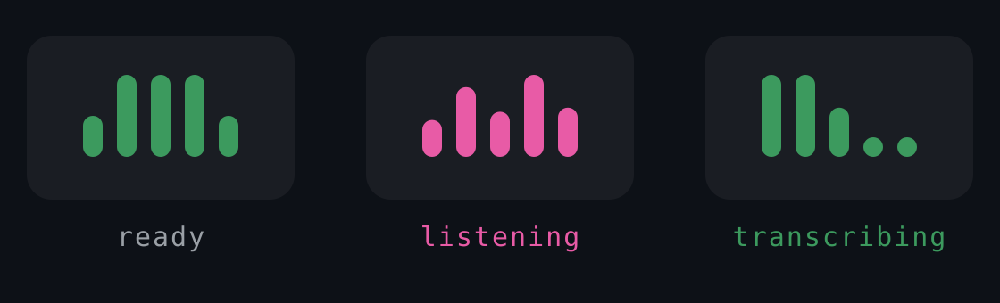

<p align="center">
  
</p>

<h1 align="center">dicti</h1>

<p align="center">
  <b>Local, offline, live dictation for Linux.</b><br>
  Tap a key, talk, and your words appear in whatever window you're using.
</p>

<p align="center">
  
</p>

<p align="center">
  <sub>100% offline · open source (MIT) · GNOME-first</sub>
</p>

## Hey, glad you're here

dicti transcribes your speech on your **own machine** with
[whisper.cpp](https://github.com/ggerganov/whisper.cpp) and types it into the focused window
as you talk. No cloud, no account, nothing leaves your laptop.

I built it because I missed having great dictation like on the Mac, and Linux deserved one
too. It's what I use every day. It's young and honest about its rough edges, and you're very
welcome to kick the tires, file issues, or help push it further.

> **Status:** v0.3.5 (alpha). Live streaming dictation that works well day to day. Tested on
> Debian + GNOME (X11). See the [roadmap](ROADMAP.md) for what's next.

## What it does

- **Talk and watch it appear.** Live streaming: text shows up as you speak. Each pass
  re-transcribes the whole utterance so whisper always has full context (so quality matches
  one-shot batch mode), and only words that have stabilised across passes get typed. It's
  append-only, so it never rewrites text behind your cursor. Prefer all-at-once? `mode =
  "batch"` is one line.
- **No "thanks for watching" on silence.** whisper-server runs with voice-activity detection
  (padded so it never clips your first word), and the stabilise-across-passes rule is a
  second filter, so the classic silence hallucinations never reach the screen.
- **Types anywhere.** ASCII goes in via `ydotool`; accented text (Polish ąęóśżźćń, etc.) is
  pasted via the clipboard, so it works across editors, IDEs and terminals. Your transcript
  is also left on the clipboard as a safety net.
- **Multilingual.** Auto-detects per pass (e.g. English + Polish), or pin a language.
- **A calm little indicator.** One animated top-bar glyph: a mic at rest, bouncing bars while
  it listens, a filling sweep while it transcribes. Quiet by default, no popup spam.
- **Yours, offline.** whisper.cpp medium model, GPU-accelerated via Vulkan. Long sessions
  (1-hour cap) with a smart silence auto-stop.

## How it works

```
[your key] -> keyd -> Super+Shift+Alt+F12 -> GNOME shortcut -> dictate-toggle
   -> unix socket -> dictation daemon -> pw-record -> /tmp WAV
   -> HTTP -> whisper-server (Vulkan) -> transcript -> ydotool / clipboard -> focused window
```

Two small user services (`whisper-server`, `dictation`) plus a GNOME Shell extension
(`dicti@local`) for the indicator. The daemon mirrors its state to
`$XDG_RUNTIME_DIR/dictation.state` so the indicator can follow along. For *why* insertion
works the type-ASCII / paste-Unicode way, see [`specs/0001-text-insertion.md`](specs/0001-text-insertion.md).

## Quick start

You'll need a Debian/Ubuntu-family distro (apt) with PipeWire audio, a Vulkan-capable GPU
(integrated is fine; CPU works but is ~4-5x slower), and GNOME Shell (tested on 48) for the
indicator.

```bash
git clone https://github.com/tksimson/dicti.git
cd dicti
bash install/install.sh
```

The guided installer runs the phases in order: system packages, the keyd key remap, building
whisper.cpp and fetching the model, the user services, ydotool, the GNOME shortcut, and the
indicator extension. You'll be asked to log out and back in once after the first phase so
your `input`-group membership takes effect. Each phase under `install/00..07` also runs on its
own.

If your dictation key isn't a Copilot/AI key, run `sudo evtest` (or `wev` on Wayland) to find
its `KEY_*` name and edit `keyd/default.conf`.

## Using it

- **Tap** your bound key to start listening, **tap again** to transcribe and insert.
- Pause to think; it won't cut off until a few minutes of real silence.
- **Left-click** the indicator to toggle, **right-click** for a menu.
- From a shell: `dictate-toggle [START|STOP|TOGGLE|CANCEL|STATUS]`.
- Lost a good dictation? `dictate-last` reprints the last one (`--copy` to clipboard).

## Configuration

dicti runs fine with no config. To tweak, edit `~/.config/dicti/config.toml` (the installer
seeds one from [`config/config.toml.example`](config/config.toml.example)), then
`systemctl --user restart dictation`. Common knobs:

| Setting | What it does |
| --- | --- |
| `mode` | `streaming` (default) or `batch` |
| `language` | `auto`, or pin like `pl` / `en` for soft/ambiguous audio |
| `silence_timeout_sec` | how long of real silence before auto-stop |
| `insert_backend` / `paste_keys` | text insertion path and paste shortcut |
| `notify_level` | `error` (default), `off`, or `all` |

Tip: whisper transcribes one language per pass. `auto` works well for mixed use now that
streaming keeps full context, but pin it (e.g. `language = "pl"`) if a quiet voice gets
detected wrong.

## Compatibility

dicti is young, so these tiers are honest about what's actually been tested. Help moving
things up the list is very welcome.

- **Tier 1, tested and supported:** GNOME on **Xorg** (Shell 48). The primary target, used
  daily.
- **Tier 2, should work, not yet verified (testers wanted):** wlroots Wayland (Sway/Hyprland,
  native Unicode via `wtype`); other X11 desktops (KDE/XFCE, via the clipboard path + the
  AppIndicator service); GNOME on Wayland (the pieces are Wayland-safe but the end-to-end
  path is unproven).
- **Known gap:** integrated terminals in **Zed / VS Code** don't accept pasted accented text
  yet (they share one window for editor and terminal, so the paste shortcut can't be
  auto-targeted). ASCII/English works there; everywhere else (browsers, editors, native apps,
  standalone terminals like gnome-terminal or kitty) full Unicode works.

## Troubleshooting

- **Slow transcription / "Dictation degraded":** whisper-server fell back to CPU. Run
  `systemctl --user restart whisper-server`; check `journalctl --user -u whisper-server`.
- **Nothing types:** make sure `ydotoold` runs and `YDOTOOL_SOCKET` is set, and that you're in
  the `input` group (log out/in after install).
- **No top-bar icon:** reload GNOME Shell (Alt+F2, `r` on X11; log out/in on Wayland), then
  `gnome-extensions enable dicti@local`.
- **Live logs:** `journalctl --user -u dictation -u whisper-server -f`.

## Roadmap & contributing

Where it's headed (and what's deliberately *not* in scope) lives in [ROADMAP.md](ROADMAP.md).
Issues and PRs are welcome, especially Tier 2 test reports from other desktops and distros.

## License

MIT, see [LICENSE](LICENSE). Uses OpenAI's Whisper model via whisper.cpp; please respect the
model's license and terms.
